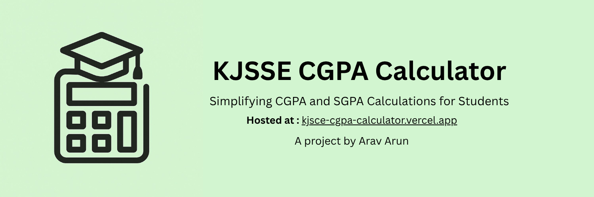

# 🎓 KJSSE CGPA Calculator

A **minimal**, **intuitive**, and **responsive** web-based calculator built to help **KJSSE students** easily compute their **CGPA** and **SGPA** based on semester grades and credits.

---

## Features :

- **SGPA & CGPA Calculation** — Accurate computation based on the university’s credit structure.  
- **Formula Explanation Modal** — View the exact method used for transparency.  

---

## Tech Stack :

- **Frontend:** HTML, CSS, JavaScript  
- **Hosting:** [Vercel](https://kjsce-cgpa-calculator.vercel.app)  
- **Repository:** [GitHub](https://github.com/Arav-Arun/KJSCE-CGPA-Calculator)

---

## Future Updates :

- **Basket Course Support:**  
  Implement accurate credit and marking logic for elective/basket courses.  

- **Branch-Specific SGPA Calculator:**  
  Add SGPA calculation for upcoming semesters tailored to each branch’s structure.  

---

## Disclaimer :

This is a **personal project** by me.  
It is **not affiliated with KJSSE**, and results are **approximate** — intended for **reference and guidance only**.

---

<!-- 

  A project by <b>Arav Arun</b>

 -->
