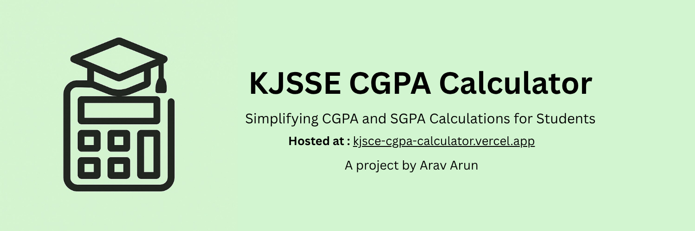

# 🎓 KJSCE CGPA Calculator

A minimal, intuitive web-based calculator built to help **KJSSE students** easily compute their **CGPA and SGPA** based on semester grades and credits.  

---

## Features :

- **SGPA and CGPA Calculation:** Accurate computation based on university credit structure.  
- **Interactive UI:** Dynamic input fields for subject marks and credits.  
- **Responsive Design:** Works seamlessly on mobile and desktop.  
- **Formula Explanation Modal:** View the exact calculation method used.  
- **Modern Dark Theme:** Built using `#1e1e1e` (dark) and `#d6f8e0` (mint green) color palette.

---

## Tech Stack : 

- **Frontend:** HTML, CSS, JavaScript  
- **Hosted on :** [Vercel](https://kjsce-cgpa-calculator.vercel.app)  
- **Repository:** [GitHub](https://github.com/Arav-Arun/KJSCE-CGPA-Calculator/)  

---
## Future Updates : 
1)Basket Course Support: Implement accurate credit and marking logic for elective/basket courses.
2)Branch-Specific SGPA Calculator: Add SGPA calculation for upcoming semesters tailored to each branch’s credit structure.
3)Overall CGPA Tracker: Introduce an overall CGPA calculator that aggregates results across all semesters.
---
Disclaimer: This is a personal project. Not affiliated with KJSSE. Results are approximate and for reference only.
